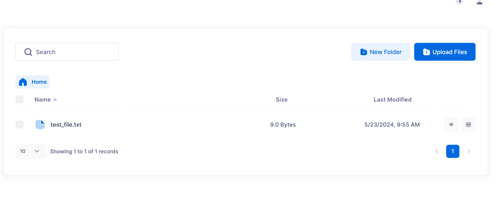
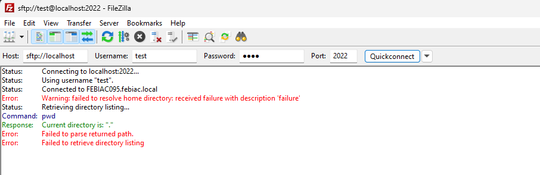

# SFTPGo External Auth Issue

In v2.6.0:

- Virtual folder must be created before being returned by the external auth hook (in `user.virtual_folders`).
- External auth hook must include the **virtual folder id**.

## Build

```sh
docker build -t sftpgo-external-auth-issue .
```

## Usage

```sh
docker run --rm -p 8080:8080 -p 2022:2022 sftpgo-external-auth-issue
```

## Relevant code changes from SFTPGo v2.5.6 changed in v2.6.0

<https://github.com/drakkan/sftpgo/blob/a6a92f0d69b8cf5e72e38ffa5e693057aa2dc776/openapi/openapi.yaml#L5872>

<https://github.com/drakkan/sftpgo/blob/a6a92f0d69b8cf5e72e38ffa5e693057aa2dc776/internal/dataprovider/sqlcommon.go#L2339-L2350>

<https://github.com/drakkan/sftpgo/blob/a6a92f0d69b8cf5e72e38ffa5e693057aa2dc776/internal/dataprovider/sqlcommon.go#L2574>

## Relevant output for the issue

1. If virtual folder with same name do not exist:

   ```json
   {"level":"debug","time":"2024-05-23T07:37:10.052","sender":"dataprovider_sqlite","message":"external auth completed for user \"test\", elapsed: 1.00203ms"}
   {"level":"debug","time":"2024-05-23T07:37:10.124","sender":"connection_failed","client_ip":"172.17.0.1","username":"test","login_type":"password","protocol":"HTTP","error":"NOT NULL constraint failed: users_folders_mapping.folder_id"}
   ```

1. If virtual folder with same name exist:

   For this example, I have created (in the web admin UI in `Virtual folders`) a new virtual folder with name `My Virtual Folder`, storage `Local disk`, Root directory `/srv/sftpgo/data/my_virtual_folder`.

   1. Web UI

      _Seems to work: Why ?_

      

      ```json
      {"level":"debug","time":"2024-05-23T07:53:19.540","sender":"dataprovider_sqlite","message":"external auth completed for user \"test\", elapsed: 1.317129ms"}
      {"level":"debug","time":"2024-05-23T07:53:19.708","sender":"dataprovider_sqlite","message":"last login updated for user \"test\""}
      ```

   2. SSH

      

      ```json
      {"level":"debug","time":"2024-05-23T08:24:20.833","sender":"dataprovider_sqlite","message":"external auth completed for user \"test\", elapsed: 823.672µs"}
      {"level":"error","time":"2024-05-23T08:24:20.906","sender":"osfs","connection_id":"80049479642f352c07ac2cee6152b7dc2aa1fb38715a3ceb18e67c9c2af91aa3","message":"error creating root directory \"\" for user \"test\": mkdir : no such file or directory"}
      {"level":"error","time":"2024-05-23T08:24:20.906","sender":"osfs","connection_id":"80049479642f352c07ac2cee6152b7dc2aa1fb38715a3ceb18e67c9c2af91aa3","message":"error creating root directory \"\" for user \"test\": mkdir : no such file or directory"}
      ```
